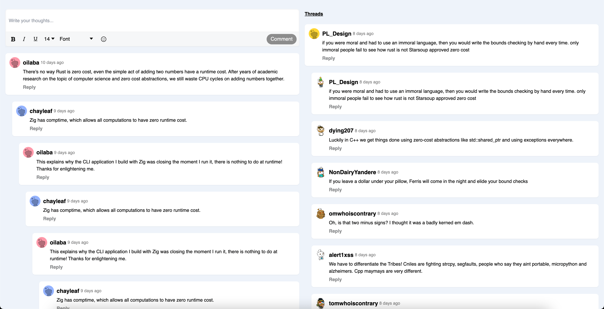
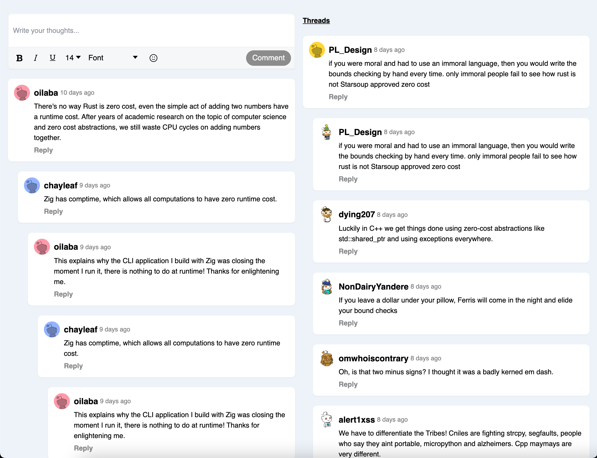
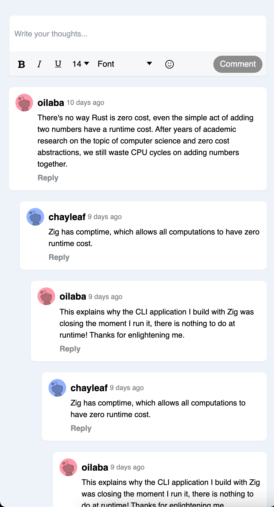

## Development

In the project directory, you can run:
### `yarn install`  
then
### `yarn start`

Open [http://localhost:3000](http://localhost:3000) to view it in the browser.

## Libraries

* [react-draft-wysiwyg](https://www.npmjs.com/package/react-draft-wysiwyg) - editor input for adding comment input
* [tailwind](https://tailwindcss.com) - for styling
* [nanoid](https://www.npmjs.com/package/nanoid) - to generate unique id
* [moment](https://www.npmjs.com/package/moment) 
* [Eslint](https://eslint.org/) 

## My Approach
- create json file with what the comments data look like and I insert some dummy data on it, data will have its id, user name, id, image,
comment date, comment text and the parent id which is the id of the main comment and array of threads that this comment has.
- created custom hook called `useComment` to seperate the logic from the UI and to get the comments data from json file first,
adding new comment or adding replying on nested threads, handle pagination, handling setting a thread as a main comment when this thread has 
a lot of nested comments. 
- created another custom hook called `useScroll` to listen to user scrolling behaviour and to detect if user scrolled to the bottom of the screen
to get more comments.
- created Components such as:
`Avatar` to display user's image.  
`CommentInput` which contain of the editor input 
`CommentItem` to display the Comment  
`CommentsList` to handle displaying all comments with its threads recursivly.
- used tailwind utilies and color themes for styling.  

## My Approach for improving the UX
- added infinite scrolling so user can paginate smoothly.  
- showing new thread section when user has many threads.

##Idea to improve UX
1- add funcionality to the editor input so user can style the comment.   
2- add collapse for comments so user can have the control of hidding and showing nested comments.  
3- add more actions such as like, upvote to make user engage more with the comments.

## ScreenShots

Desktop
 
Desktop With Thread
 
Tablet     
 
Mobile       
 
